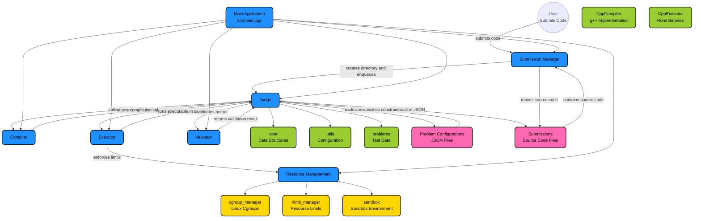

# Judge Engine

A **sandboxed coding judge written in C++** that securely compiles and executes user submissions using Linux kernel resource control mechanisms. The system is designed to evaluate competitive programming solutions by compiling submitted code, running it inside an isolated environment, and generating verdicts based on runtime behavior and output.

The project focuses on **systems-level execution control**, using process isolation and kernel resource limits to safely execute untrusted programs.

## Features

### Secure Execution

User programs are executed inside an isolated environment using:

- **Linux cgroups** to enforce memory, CPU, and process limits
- **rlimits** to restrict runtime resource usage
- **fork/exec** process isolation
- controlled **stdin/stdout/stderr redirection**


### Compilation Pipeline

The current system supports:

C++ submissions

Each submission is compiled into an executable that is stored in the submission directory and later executed by the sandbox.

### Multi-Test Evaluation

Submissions are evaluated against multiple test cases.

For each test case:

1. The test input is provided to the user program.
2. The program is executed inside the sandbox.
3. Output and errors are captured.
4. Runtime statistics are recorded.

Execution stops early if a failure verdict is detected.

### Runtime Monitoring

During execution, the judge records:

- execution time
- peak memory usage
- process exit status
- termination signals

This information is used to determine the final verdict.

### Verdict Detection

The judge currently detects the following outcomes:

AC – Accepted  
WA – Wrong Answer  
TLE – Time Limit Exceeded  
MLE – Memory Limit Exceeded  
RE – Runtime Error  

Verdicts are determined using execution results, termination signals, and resource usage.

---

## Execution Pipeline

The evaluation pipeline follows this structure:
```
Submission
↓
Compile source code
↓
For each test case
↓
Create sandbox environment
↓
Execute program
↓
Capture output and resource usage
↓
Generate verdict
```

## Sandbox Design

Execution isolation is handled through a sandbox layer that abstracts system resource controls.

The sandbox is responsible for:

- creating and managing **cgroups**
- applying **resource limits**
- attaching execution processes to the sandbox
- collecting **memory usage statistics**
- cleaning up the environment after execution

Two major components power the sandbox:

**CGroupManager**
- creates and manages cgroups
- sets memory, CPU, and process limits
- tracks runtime memory usage

**rlimits**
- enforce CPU time limits
- restrict memory space
- restrict output file size

## Project Structure

```
judge-engine
 ┣ .vscode
 ┃ ┗ c_cpp_properties.json
 ┣ include
 ┃ ┣ compiler
 ┃ ┃ ┣ c_compiler.hpp
 ┃ ┃ ┣ compilation_result.hpp
 ┃ ┃ ┣ compiler.hpp
 ┃ ┃ ┣ cpp_compiler.hpp
 ┃ ┃ ┗ python_compiler.hpp
 ┃ ┣ core
 ┃ ┃ ┣ config.hpp
 ┃ ┃ ┣ judge.hpp
 ┃ ┃ ┣ language.hpp
 ┃ ┃ ┣ submission.hpp
 ┃ ┃ ┣ submission_manager.hpp
 ┃ ┃ ┣ validator.hpp
 ┃ ┃ ┗ verdict.hpp
 ┃ ┣ executor
 ┃ ┃ ┣ c_executor.hpp
 ┃ ┃ ┣ cpp_executor.hpp
 ┃ ┃ ┣ execution_result.hpp
 ┃ ┃ ┣ executor.hpp
 ┃ ┃ ┣ python_executor.hpp
 ┃ ┃ ┗ termination_signal.hpp
 ┃ ┗ system
 ┃ ┃ ┣ cgroup_manager.hpp
 ┃ ┃ ┣ rlimit_manager.hpp
 ┃ ┃ ┗ sandbox.hpp
 ┣ problems
 ┃ ┣ A
 ┃ ┃ ┣ tests
 ┃ ┃ ┃ ┣ input1.txt
 ┃ ┃ ┃ ┗ output1.txt
 ┃ ┃ ┗ config.json
 ┃ ┗ B
 ┃ ┃ ┣ tests
 ┃ ┃ ┃ ┣ input1.txt
 ┃ ┃ ┃ ┗ output1.txt
 ┃ ┃ ┗ config.json
 ┣ src
 ┃ ┣ compiler
 ┃ ┃ ┣ c_compiler.cpp
 ┃ ┃ ┣ compilation_result.cpp
 ┃ ┃ ┣ cpp_compiler.cpp
 ┃ ┃ ┗ python_compiler.cpp
 ┃ ┣ core
 ┃ ┃ ┣ judge.cpp
 ┃ ┃ ┣ submission_manager.cpp
 ┃ ┃ ┗ validator.cpp
 ┃ ┣ executor
 ┃ ┃ ┣ c_executor.cpp
 ┃ ┃ ┣ cpp_executor.cpp
 ┃ ┃ ┣ execution_result.cpp
 ┃ ┃ ┗ python_executor.cpp
 ┃ ┣ system
 ┃ ┃ ┣ cgroup_manager.cpp
 ┃ ┃ ┣ rlimit_manager.cpp
 ┃ ┃ ┗ sandbox.cpp
 ┃ ┗ main.cpp
 ┣ submissions
 ┣ .gitignore
 ┣ CMakeLists.txt
 ┗ README.md
 ```

## Resource Isolation

Each execution is performed inside a dedicated sandbox with limits applied through cgroups:

- memory.max
- cpu.max
- pids.max

This ensures user programs cannot consume excessive system resources or affect the host system.

## Requirements

The project requires a Linux environment with cgroups v2 enabled.

Dependencies include:

- Linux
- g++
- cmake
- jsoncpp

The system relies on Linux system calls such as:

- fork
- exec
- waitpid
- setrlimit

## Current Limitations

The current version supports:

- C++ submissions only
- local execution on a single machine
- sequential submission evaluation

---

## Planned Improvements

Future improvements include:

- multi-language support
- concurrent submission processing
- syscall filtering using seccomp
- filesystem isolation using namespaces
- distributed worker architecture

## Architecture Diagram
